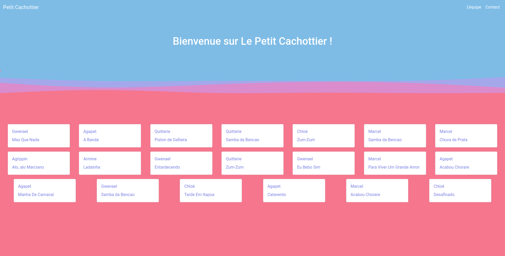

# Petit Cachottier

[](https://forthebadge.com)
[](https://forthebadge.com)
[](https://forthebadge.com)
[](https://forthebadge.com)

[](https://rubyonrails.org/)

## Aperçu

Appli de commérage à gogo 🤫

Site web codé pour apprendre les bases de Ruby on Rails pendant le jour 26 de THP.

## Screenshots




## Versions

[](https://www.ruby-lang.org/fr/) V 2.7.4

[](https://rubyonrails.org/) V 5.2.3

## Installation et lancement

1. Ouvrez un terminal
2. Rendez-vous dans le répertoire du projet
3. Entrez :

```shell
$ bundle install
$ rails db:create
$ rails db:migrate
$ rails db:seed
$ rails server
```
4. Ouvrez votre navigateur à l'URL fournie par le serveur *(habituellement `http://localhost:3000/`)*
5. C'est parti pour le fun ! Bonne correction !

## ToDo

- [x] Page présentation
- [x] Page contact
- [x] Page cachée
- [x] Page d'accueil
- [x] Page show gossip
- [x] Page show utillisateur
- [x] Page new gossip
- [x] Page show city
- [x] Page edit gossip
- [x] Destroy gossip
- [ ] Création commentaires
- [ ] Affichage commentaires
- [ ] Modification commentaires
- [ ] Suppression commentaires
- [x] Tags
- [ ] Signup
- [ ] Login / Logout
- [ ] Likes

## Crédits et remerciements

Merci à [The Hacking Project](https://www.thehackingproject.org/) et à tous les moussaillons pour cette formation de qualité !
